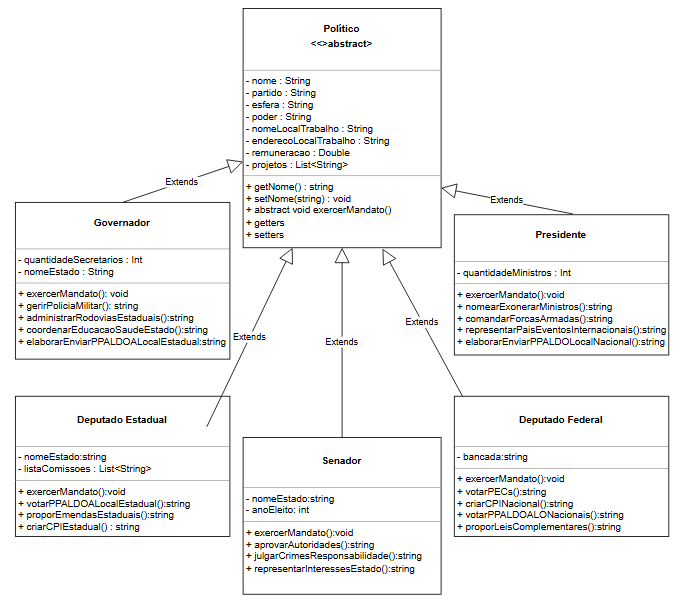

# 🗳️ Eleições 2026

> **Trabalho de Programação 2 - POO**
> IFPE Campus Jaboatão dos Guararapes

---

### 👥 Dupla

**Matheus Augusto** • **Allycia da Silva**

### 📌 Sobre

Sistema de cadastro de políticos para as eleições de 2026.

O trabalho utiliza os conceitos de:

`Encapsulamento` • `Herança` • `Polimorfismo` • `Abstração`

### 📐 Diagrama de Classes

---

**Professora:** Havana Diogo Alves Andrade
